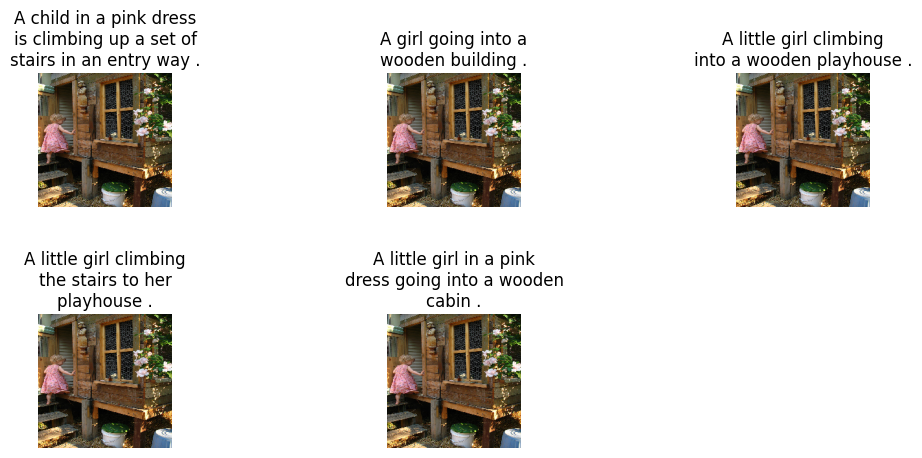
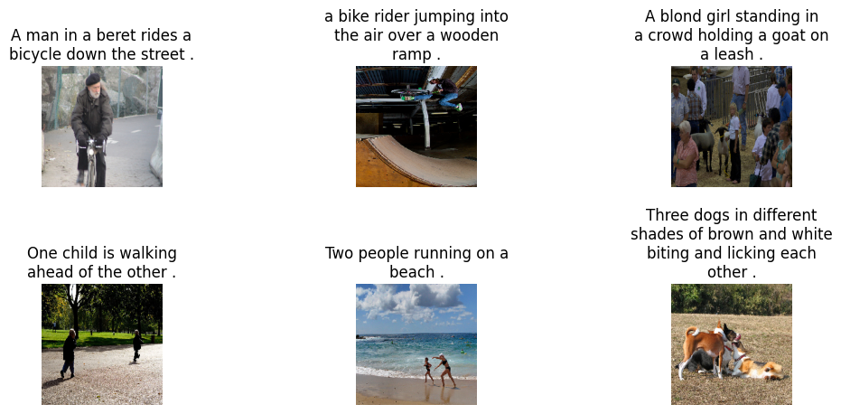
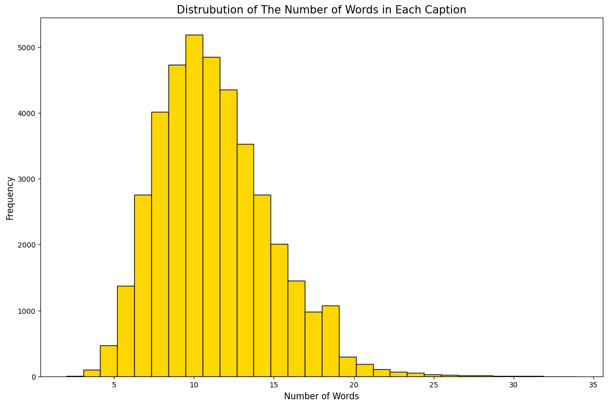
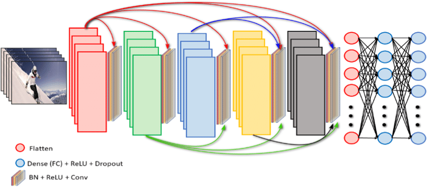
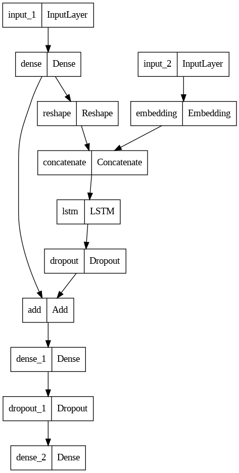
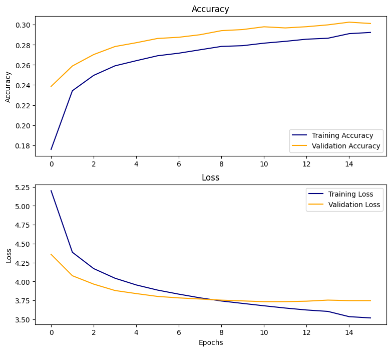
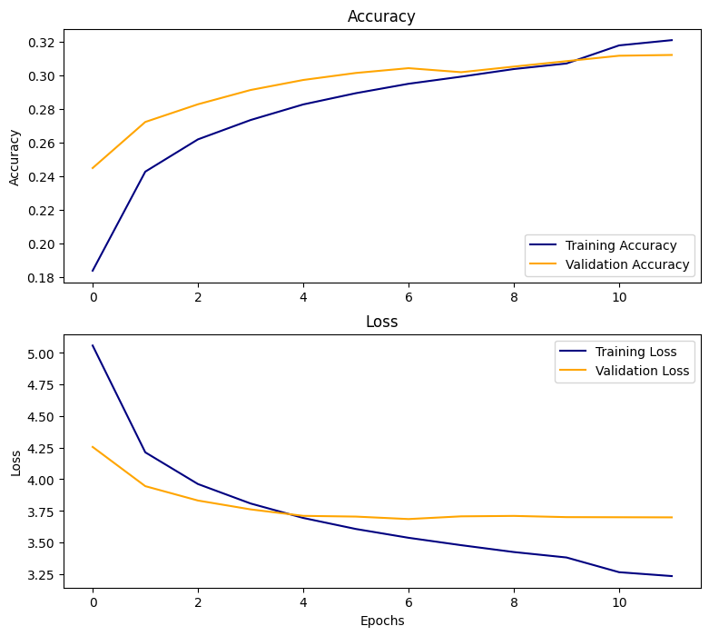
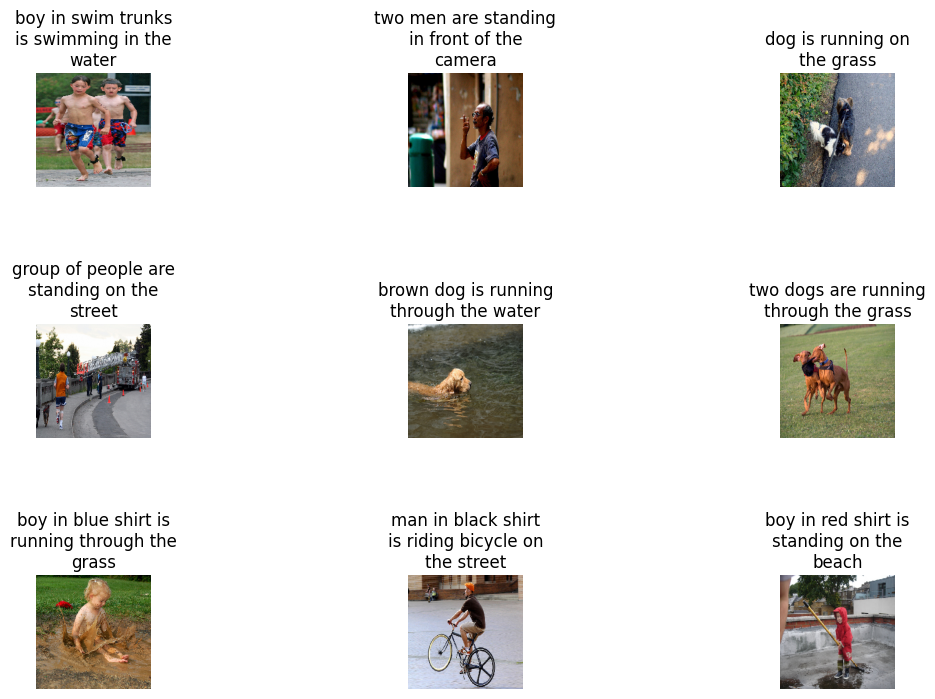

# Developing Image Captioning Model With Deep Learning

### Problem Statement

Developing an image captioning model with the ability to generate accurate and relevant captions for images, specifically aimed at assisting visually impaired individuals. The model will utilize deep learning techniques such as convolutional neural networks and long short-term memory networks, as well as pre-trained models for feature extraction and GloVe embeddings for text representation. The objective is to improve accessibility for visually impaired individuals by providing them with a more comprehensive understanding of the content of images through generated captions.

---

### Background

Visual content, such as images and videos, are ubiquitous in today's digital world and are used in a wide range of applications, from social media and e-commerce to education and entertainment. However, for visually impaired individuals, these forms of content can be inaccessible, hindering their ability to fully participate in the digital world. To address this issue, researchers have developed various assistive technologies, such as screen readers and image recognition systems. One promising solution is image captioning models, which involve generating textual descriptions of images that can aid visually impaired individuals in understanding the content and context of the image.

However, despite the progress made in these models, there are still several challenges that need to be addressed. One major challenge is the ability of the model to capture the nuances of natural language and generate captions that are both accurate and easy to understand. Another challenge is the lack of diversity in existing datasets, which can result in biased and limited image captioning models.

In this project, we aim to develop a deep learning-based model for addressing these challenges and improve the accessibility of visual content for visually impaired individuals.

---

### Datasets

The raw image datasets are provided from Flickr 8k Dataset from [Kaggle](https://www.kaggle.com/datasets/adityajn105/flickr8k): consisting of 8,000 images that are each paired with five different captions which provide clear descriptions of the salient entities and events.The images were chosen from six different Flickr groups, and tend not to contain any well-known people or locations, but were manually selected to depict a variety of scenes and situations.

---

**Please Note : Google Colab has been used to do every steps represented in this project. Also should be considered that all datasets and GloVe pre-trained word vectors have been downloaded into google dirve. Image features from 02_Image_Feature_Extraction and also final models from 03_Image_Captioning_Models are not uploaded here in this repository because of the Github data uploading size limitation. If you have further questions about these parts, feel free to contact me anytime.**

---

### Data Sets, Preprocessing, and Exploratory Data Analysis (EDA)

The purpose of EDA here is to gain a better understanding of the data, its quality, structure, and distribution, and to identify any issues that may affect the model's performance. In the context of image captioning, EDA can involve analyzing the image data and the associated captions, including their length, content, and vocabulary.

### Data Sets 

As said before, in our dataset, each image has 5 different and clear captions. In the following you could see the sample of images with its 5 different captions.

Also here we could see 6 different samples of images with their related captions.

### Preprocessing
In image captioning, the goal is to generate natural language descriptions of an image. Caption preprocessing and cleaning are to remove noise and irrelevant information from the text data and to ensure consistency and readability in the captions. By properly cleaning and preprocessing the caption data, we can improve the accuracy and performance of the image captioning model.
Here are the techniques that we will use in preprocessing and cleaning captions:

**Caption Text Preprocessing Steps**

- Convert sentences into lowercase
- Remove special characters and numbers present in the text
- Remove punctuations in the text
- Remove extra spaces
- Remove single characters
- Add starting and ending tags to the sentences to indicate the beginning and the ending of a sentence (By adding start and end tags, we are essentially giving the model a cue as to when the caption starts and ends. During training, the model learns to predict the next word in the caption given the previous words. By adding the start tag at the beginning, the model knows that it needs to start generating a caption, and by adding the end tag at the end, the model knows that it has completed generating the caption.)

### Exploratory Data Analysis (EDA)
In image captioning, the length of the generated captions can have a significant impact on the performance and quality of the model. It is therefore important to understand the distribution of caption lengths in the training data. One way to visualize this distribution is to use a histogram.

The resulting histogram can provide insights into the distribution of caption lengths in the training data. For example, it may reveal that most captions are relatively short, with a few longer captions that are outliers. This information can be used to inform the design and development of the image captioning model, such as adjusting the maximum caption length or exploring techniques for handling longer captions.
The below histogram shows the distribution of captions lengths. It shows that the most captions length are 10 and it has the normal distribution. By this histogram we will set the maximum caption length to 25. By setting a maximum caption length, we ensure that the model can handle captions of different lengths, making it more robust and generalizable. If a caption in the training set is longer than 15 words, it will be truncated to 15 words. Similarly, if a caption is shorter than 15 words, it will be padded with special tokens to reach the desired length.

#### Vectorize the text
The resulting plot can provide insights into the most frequent words. By having this plot we could see that most images are about people and dogs, explaining what they are wearing or doing with color detail descriptions.

### EDA and Cleaning Summary

- We analyzed the image and caption data to get an understanding of the dataset's characteristics.
- Cleaned the captions by applying several pre-processing steps, such as lowercasing, removing special characters, extra spaces, and single characters. Beside that, we added start and end tokens. we are essentially giving the model a cue as to when the caption starts and ends.
- Created a new dataset that includes cleaned image-caption pairs. This cleaned dataset will serve as the input for training the image caption model.
- Also plotted a histogram of caption lengths to understand the distribution of caption lengths in the cleaned dataset. This visualization helps inform the choice of hyperparameters for the model, such as the maximum caption length.

---

## Image Feature Extraction
Image feature extraction is a critical step in image captioning, as it involves converting raw image data into a set of numerical features that can be used as input to the image captioning model. One way to perform to do is to use a pretrained deep learning CNN models such as VGG16, ResNet, Densenet201 or Inception. These models are trained on large datasets such as ImageNet (a large-scale dataset consisting of more than 14 million labeled images across 20,000 different categories), and have learned to extract meaningful and discriminative features from images.

The process of using a pretrained model for image feature extraction involves the following steps:

- Load the Pretrained Model
- Remove the Classification Layers: These layers are designed to predict the class label of an image, which is not relevant for image feature extraction.
- Extracting Image Features: This is done by passing each image through the modified model, and obtaining the output of one of the intermediate layers. The output of this layer represents a set of high-level features that capture the visual content of the image.
- Save the Extracted Features

Overall, using a pretrained CNN model for image feature extraction is a powerful technique that can significantly improve the performance of image captioning models. By leveraging the power of these models, we can obtain a rich representation of the visual content of images, which can be used to generate accurate and informative captions.

### CNN Pre-Trained Models
Here we will utilize Densenet201 and VGG16 for extracting features from images. VGG16 is a relatively simple architecture compared to DenseNet201, with 16 layers of convolution and pooling operations. It has been widely used for transfer learning in image classification tasks and has achieved state-of-the-art performance on several benchmark datasets. However, VGG16 is computationally expensive and can be slow to train.

DenseNet201, on the other hand, has more layers and a more complex architecture that allows for better feature reuse and can improve the flow of information through the network. It has also shown good performance on a variety of image classification tasks, and is relatively computationally efficient compared to some other deep neural network architectures.

In general, if you have a large dataset and computational resources, DenseNet201 may be a better choice, as it can capture more complex features and can potentially achieve better performance. If you have limited data and computational resources, VGG16 may be a better choice, as it is simpler and faster to train.

### Pre-Trained DenseNet201 Model
We set the input layer to be the same as the input layer of the original DenseNet201 model, and the output layer to be the second-to-last layer of the original model. This removes the final classification layer, which was responsible for predicting the class labels of the input images. The below image shows us the architecture of Densenet201 which is dowloaded from https://www.researchgate.net/figure/DenseNet201-architecture-with-extra-layers-added-at-the-end-for-fine-tuning-on-UCF-101_fig2_353225711 .

**DenseNet201 architecture with extra layers added at the end for fine tuning**

### Pre-Trained VGG16 Model
Like DenseNet 201, we set the input layer to be the same as the input layer of the original DenseNet201 model, and the output layer to be the second-to-last layer of the original model. This removes the final classification layer, which was responsible for predicting the class labels of the input images. The below image shows us the architecture of VGG16 which is dowloaded from https://www.hindawi.com/journals/am/2023/6147422/ .

### Image Feature Extraction Summary
- loaded two pre-trained models, VGG16 and DenseNet201.
- Removed the classification layer from both models.
- Passed each image in our dataset through each of these models to obtain a set of features for the image.
- Extracted features stored in separate files.

**These extracted features will be used as input to train an image captioning model**

---

## Image Captioning Models
The goal of this project as explained before, is to create an image captioning model that can generate descriptive and accurate captions for images. To achieve this, we first explored the dataset and cleaned the captions, by visualizing the distribution of caption lengths, we determined the maximum caption length. We then utilized pre-trained CNN models, VGG16 and DenseNet201, to extract image features which will be passed through an LSTM model to generate captions. To enhance the quality of the captions, we will also utilize GloVe embeddings to represent the words in the captions, allowing the model to better understand the semantic meaning of the words. During training, the models will be trained using a large dataset of image-caption pairs, and the weights of the model will be updated using backpropagation to minimize the loss function. Once trained, the model can be used to generate captions for new images by passing the image through the CNN and then feeding the extracted features into the LSTM to generate the caption word by word. Overall, the CNN-LSTM combination is a powerful approach for image captioning that leverages the strengths of both architectures, and has been shown to achieve state-of-the-art results on various benchmarks.

### Data Generation
- This model is exactly the same as the previous CNN with regularization techniques implemented, with an addition of a data augmentation technique.
- Because the audio data has essentially been transcoded into something similar to an image, flipping the "image" can effectively add more diverse data for the model to train on. This flipping is analogous to feeding the audio clip through the model in reverse.
- Adding this diversity in data can improve the model without having to truly provide it more data.
- As can be seen below, the model begins overfitting very early on, similar to the other CNNs. It also continues improving like the CNN with regularization. The difference is that it learns a little slower, but keeps a closer range between the train and test data, allowing for an increase in overall performance.

### Tokenization and Model with GloVe's Pretrained Embeddings
The words in a sentence are separated/tokenized and encoded in a one hot representation. These encodings are then passed to the embeddings layer to generate word embeddings. The basic idea behind the GloVe word embedding is to derive the relationship between the words from statistics. Unlike the occurrence matrix, the co-occurrence matrix tells you how often a particular word pair occurs together. Each value in the co-occurrence matrix represents a pair of words occurring together.

### Modelling With Extracted Image Features From DenseNet201 and VGG16
The image embedding representations are concatenated with the first word of sentence ie. starsen and passed to the LSTM network and the LSTM network starts generating words after each input thus forming a sentence at the end.
We used The same model architecture for both extracted image features from DenseNet201 and VGG16 to have a clear evaluation by having the same conditions. For both models we leveraged normalization techniques like dropout to prevent overfitting, beside that we defined callbacks like ModelCheckpoint, EarlyStopping and ReduceLROnPlateau for monitoring and reducing the loss score.

**Image Caption Model Architecture**

In the following we could see the plots showing the loss and accuracy score over the number of epochs in each model.

**Accuracy and Loss Score With DensNet201-LSTM Model**

**Accuracy and Loss Score With VGG16-LSTM Model**

|**Model**|**Accuracy**|**Loss**|
|---|---|---|
|**DensNet201-LSTM**|0.30|3.74
|**VGG16-LSTM**|0.31|3.69

In the following we could see some result samples of images with their generated captions by our model.

---

## Text-To-Speech System For Generated Captions
Text-to-speech is the process of converting written text into spoken words. This technology has numerous applications, including assisting people with visual impairments to access digital content such as web pages, books, and other forms of text-based media.

In the context of our project, text-to-speech can be used to generate audio descriptions for the images that we have captioned. This can be particularly useful for blind or visually impaired individuals who may not be able to see the images themselves, but can still benefit from a verbal description of the content.

To generate audio descriptions for the images in our project, we used gTTS to convert the image captions into spoken words.

---

### Conclusions and Recommendations

### Conclusions
- Based on the project, we have successfully developed an image captioning model that can generate captions for images. The model combines both Convolutional Neural Network (CNN) and Long Short-Term Memory (LSTM) networks to generate captions that are relevant to the image content. We have also utilized GloVe word embeddings to improve the accuracy of the generated captions.
- To extract the image features, we have used pre-trained models, VGG16 and DenseNet201, and found that final model (CNN-LSTM) performance with VGG16 is slightly better in terms of loss and accuracy score.
- Finally, we have utilized text-to-speech technology to convert the generated captions into audio descriptions for visually impaired individuals.

### Recommendations
- We suggest further exploration can be conducted on the impact of different pre-trained models and different word embeddings on the accuracy of the model.
- Additionally, using larger datasets, such as Flickr30k, MSCOCO and SBU can potentially improve the accuracy of the image captioning model as it provides more diverse and comprehensive data for the model to learn from. In addition, working with larger datasets can help to reduce overfitting and increase the generalization ability of the model.
- Moreover, we should consider expanding the application of the model. For example, we could use the same model to generate descriptions for videos or to generate captions for images in a different domain, such as medical imaging.

Overall, this project showcases the potential of using machine learning techniques to develop solutions that can enhance accessibility and inclusivity for people with disabilities.
